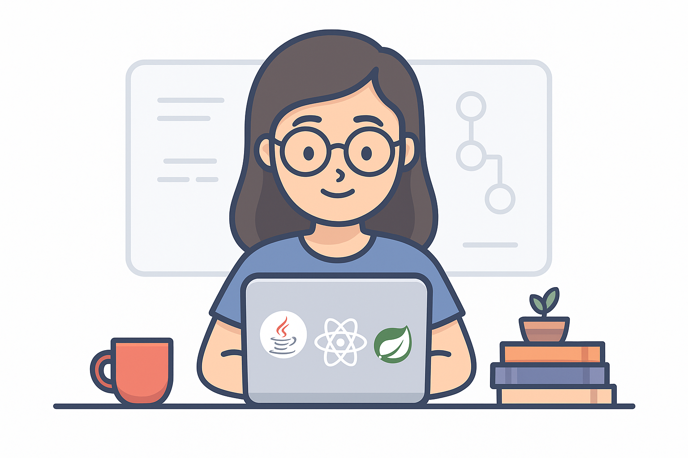

<!-- Bannière animée ou image -->
# 👩‍💻 Hi, I'm Hasnae Moulim  

🎓 **Software Engineer** | 💡 Passionate about scalable systems & innovative solutions  
🌍 From Morocco | 🚀 Always learning & exploring new technologies  

  

## ✨ About Me  

🔭 Currently working on innovative **software engineering projects**  
🌱 Learning **React Native**, **Angular**, and exploring **AI in software**  
📫 Reach me at **hasnaemoulim@gmail.com**  
⚡ Fun fact: *I turn ☕ coffee into clean, scalable code* 

---

## 🛠️ Tech Stack  

### 💻 Programming Languages  

  
  

### 📚 Frameworks & Libraries  

  
  
  

### ⚙️ Development Tools & Messaging  

  
  

### 🗄️ Databases  

  
  

### 🎨 Design & Modeling  

  
  

### 📋 Project Management  

  
  
  
  

---

## 🌐 Connect with Me  

  
  
  

---

## 📊 GitHub Stats  

  

---

✨ *“Turning ideas into scalable and efficient software solutions.”*  
